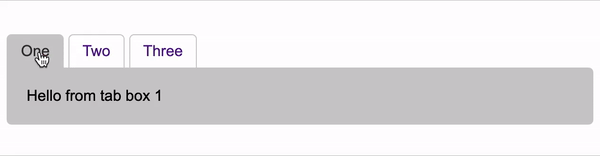

# seo-tabs

SEO friendly tabs written in 1k of vanilla JavaScript.

Goals _(keep it really f'kin simple)_:

- [x] Minimal, semantic HTML tags
- [x] Intuitive markup relationship
- [x] Set default tab without JS
- [x] SEO friendly _(crawlable, minimal js)_
- [x] Zero CSS conflicts _(uses HTML5 data-* attributes)_
- [x] Bookmarkable _(add `data-hashable="true"`)_

You can view a live version of this at [orcascan.com](https://orcascan.com/guides/how-to-connect-orca-scan-to-your-database-5d9695c8#how-do-i-create-a-lookup-url-for-my-system).

## Usage

Add the [seo-tabs.min.js](dist/seo-tabs.min.js) and [seo-tabs.min.css](dist/seo-tabs.min.css) files to your page:

```html
<script src="path-to/seo-tabs.min.js"></script>
<link href="path-to/seo-tabs.min.css" />
```

Add the minimal, semantic markup for your tabs:

```html
<div data-seo-tabs="true" data-hashable="true">
    <a href="#one" data-tabtop="true" data-active="true">One</a>
    <a href="#two" data-tabtop="true">Two</a>
    <a href="#three" data-tabtop="true">Three</a>
    <div id="one" data-tabbox="true" data-active="true">
        Hello from tab box 1
    </div>
    <div id="two" data-tabbox="true">
        Hello from tab box 2
    </div>
    <div id="three" data-tabbox="true">
        Hello from tab box 3
    </div>
</div>
```

Override default style using CSS:

```css
/* tap tops */
[data-seo-tabs="true"] [data-tabtop="true"] {
    border: 1px solid #ccc;
    border-bottom: 0;
}

[data-seo-tabs="true"] [data-tabtop="true"][data-active="true"] {
    background: #ccc;
    color: #333;
}

/* tab boxes */
[data-seo-tabs="true"] [data-tabbox="true"] {
    background: #ccc;
    border: 1px solid #ccc;
}

[data-seo-tabs="true"] [data-tabbox="true"][data-active="true"] {
    background: #ccc;
}
```

The above code produces:



## Contributing

1. Fork it!
2. Create a branch: `git checkout -b my-new-feature`
3. Commit your changes: `git commit -m 'Add some feature'`
4. Push to the branch: `git push origin my-new-feature`
5. Submit a pull request :muscle:

### Development

The project includes everything you need to tweak, including a node webserver. Run the following:

```bash
git clone https://github.com/john-doherty/seo-tabs
cd seo-tabs
npm install
npm start
```

Then visit [http://localhost:8080](http://localhost:8080) in your browser.

### Update .min files

Update the minified files from source by increasing the version number in `package.json` and run the following:

```bash
npm run build
```

## Star the repo

If you use this useful please star the repo, it helps me prioritize which open source issues to tackle first.

## History

For change-log, check [releases](https://github.com/john-doherty/seo-tabs/releases).

## License

Licensed under [MIT License](LICENSE) &copy; [John Doherty](https://twitter.com/mrjohndoherty)
